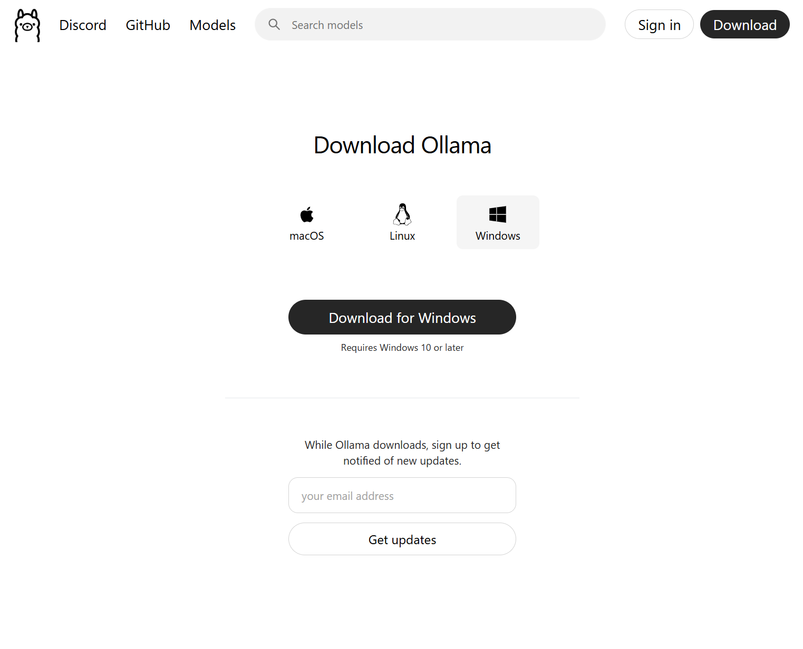
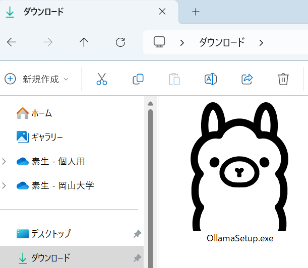

# ローカルLLM体験ワークショップ：Ollama & DeepSeek編



---

## 📋 事前準備チェックリスト（重要！）

### ✅ 事前インストール必須項目
- [ ] **Ollama本体** (約980MB) - 必ず事前にインストール
- [ ] **LLMモデル** (約2.2GB) - 必ず事前にダウンロード  
- [ ] **Python 3.7以上**
- [ ] **requests ライブラリ**

---

## 🚀 セットアップ手順

### 1️⃣ Ollamaのインストール

[公式サイトからダウンロード](https://ollama.com/download)

**Windows の場合:**
1. `ollama-windows.exe` をダウンロード
2. ダブルクリックで実行
3. インストール完了まで待つ

**Mac の場合:**
```bash
brew install ollama
```

または [公式サイト](https://ollama.com/download) からダウンロード



### 2️⃣ LLMモデルのダウンロード

コマンドプロンプト/ターミナルで実行：

```bash
# モデルをダウンロード（約2.2GB、時間がかかります）
ollama pull phi3

# モデルが正常に動作するかテスト
ollama run phi3
```


### 3️⃣ Python環境のセットアップ

```bash
# 仮想環境の作成
python -m venv .venv

# 仮想環境の有効化
# Windows の場合:
.venv\Scripts\activate

# Mac/Linux の場合:
source .venv/bin/activate

# 成功すると先頭に (.venv) が表示される
# 例: (.venv) PS C:\Users\username\local_llm_ws>

# 必要なライブラリをインストール
pip install requests
```

### 4️⃣ サンプルプログラムの実行

```bash
# プログラムを実行
python test.py

# 質問を入力してEnter
# 例: "Pythonとは何ですか？"
```

---

## 📁 ファイル構成

```
local_llm_ws/
├── README.md           # このファイル
├── test.py            # サンプルプログラム
├── slide.html         # プレゼン資料
├── 目次.md             # 学習内容の目次
└── demo-image/        # 画像フォルダ
```

---

## 🛠️ トラブルシューティング

### よくある問題と解決方法

**Q: `ollama pull` でエラーが出る**
- A: インターネット接続を確認し、時間をおいて再実行

**Q: `python test.py` でエラーが出る**  
- A: 仮想環境が有効化されているか確認
- A: `pip install requests` が実行済みか確認

**Q: AI が応答しない**
- A: `ollama run phi3` でモデルが起動しているか確認
- A: `http://localhost:11434` にアクセスできるか確認

---

## 📚 学習コンテンツ

- **[プレゼン資料](./slide.html)** - ワークショップ用スライド
- **[学習目次](./目次.md)** - LLM/RAG/AIエージェントの概要

---

## 💡 ワークショップの流れ

1. **環境確認** - セットアップが完了しているか確認
2. **基礎理論** - LLM/RAG/AIエージェントの学習
3. **実践演習** - サンプルコードの実行と改良
4. **応用課題** - オリジナル機能の実装

準備完了したら講師にお声かけください！